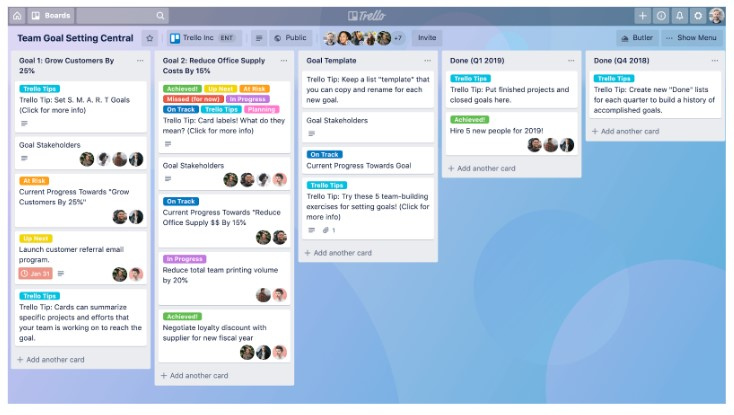
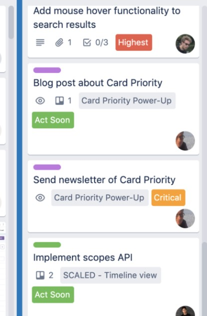
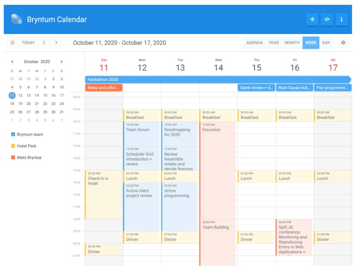

# WorkCal - Naptár alapú, munkaerő kezelő rendszer készítése

## Leírás

Adott X irodai alkalmazott aki kezeli a rendszert és egy webes felületen felviszi az eseményeket, amelyhez munkaerőt tud rendelni, pontos adatokat tud megadni illetve időpontot. Például: bútorszerelés 1044 Kocsma körút 13. szám alatt, 2021.03.04-én 11:00-15:00 óra között amelyhez Tóth Béla és Nagy Géza van hozzárendelve, mint munkaerők.

A helyszínre kiérkező kollégáknak kell egy mobilalkalmazás is (vagy minimum reszponzív webes UI) amelyen az ő részüket intézik.

A helyszínre kiérkező kolléga a helyszínen előveszi a telefont, be tudja jelenteni, hogy mikor kezdi a munkát, majd a munka végeztével is be kell csekkolnia és képet kell készítenie a helyszínen az elkészült munkáról. Ekkor a munka késznek tekinthető amelyet jelezni szükséges a webes felületen dolgozó irodai munkaerőnek. A munka leadásakor GPS koordináta alapján le kell kérdezni, hogy biztosan a munka helyén tartózkodik-e az munkát végző kolléga.

### Drag n drop

Az eseményeket lehessen ide-oda pakolgatni drag-n-drop módszerrel a naptár nézetben, hasonlóan mint Google Calendar vagy Trello esetében.

### Munkaerő hozzárendelés

Az eseményhez hozzárendelt munkaerők kapjanak erről értesítést (ha törlődik egy munka, ha módosul egy munka, ha létrejön egy munka).

### Munkaóra elszámolás

Adott hónapban (vagy tetszőleges időszakok között) lehessen lekérdezni, hogy adott munkaerő hány órával volt leterhelve, így könnyen és gyorsan lehet ellenőrizni, hogy pl. havi szinten dolgozott-e kellő időt és esetleg mennyi túlórája van. Ehhez legyen egy admin felület ahol a kimutatások láthatók minden munkaerőről, illetve egy dolgozóknak szóló felület is, ahol adott munkaerő a saját kimutatásait tudja látni kizárólag. Az admin felületen lehessen munkaerőket felvinni.

### Nyomtatás

Az irodai alkalmazott legyen képes kinyomtatni az adott napra vonatkozó eseményeket, minden odatartozó adattal. Hogy ez pontosan milyen elrendezésben legyen, erről egyeztetni szükséges. A fő cél a jó átláthatóság, nem a szépség.

## Elvárások látványtervileg

* az eseményeknél a hozzárendelt munkaerő kis képen jelenjen meg (ha több van, akkor mindegyik)
* az eseményeknél ha a munkaerő késznek jelenti a helyszínen, akkor a bal felső sarokban egy zöld pipa ikon jelenjen meg
* az eseményekhez lehessen színeket rendelni (teljes esemény “kártya”)
    * és lehessen szabadon létrehozható színes tag-eket létrehozni
* adott eseményre kattintva jobb oldalt egy sávban nyíljon meg ahol az adatokat ki lehet tölteni
* ezt az ablakot legyen lehetőség “középre” nagyítva is kirakni a jobb kitölthetőség érdekében

## Felhasználandó inspirációs minták

